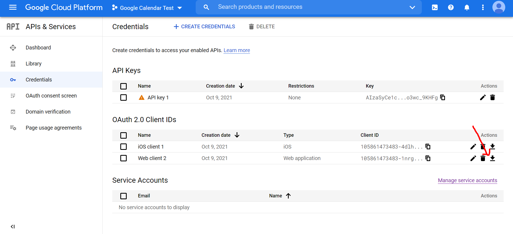

# Download your Credential json 
save it as **credential.json**



Run 
```
    pip intsall -r requirements.txt
```
## | To fetch event list run below commands

```
python get_event_list.py
```
## | To Create event run below commands

```
python get_event_list.py
```